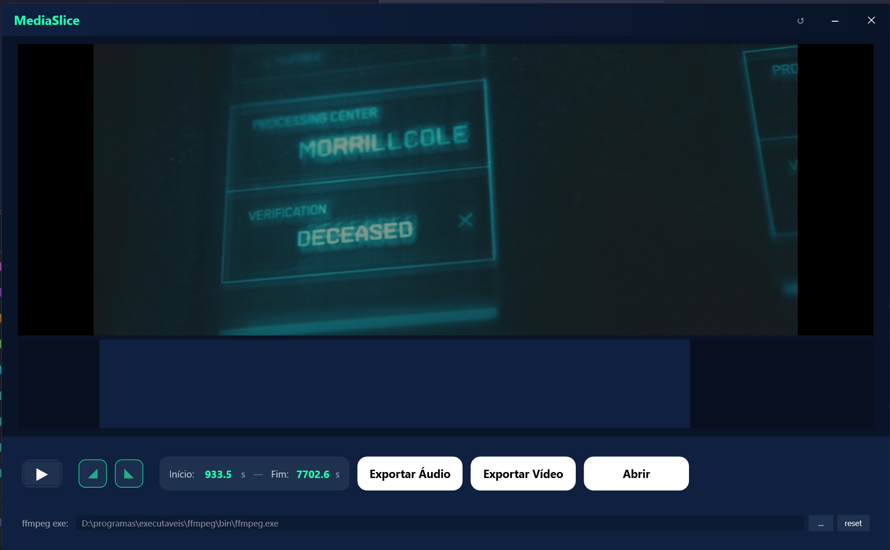

# 🎬 MediaSlice

Cortador de mídia desenvolvido em C# com WPF. Permite realizar cortes precisos em vídeos e áudios, aplicar efeitos de *Fade In* e *Fade Out*, e exportar o resultado com qualidade máxima.



## ✨ Funcionalidades

- **Suporte a Vídeo e Áudio:** Trabalhe com MP4, MKV, AVI, MOV, MP3, WAV e outros formatos comuns.
- **Visualização de Onda (Waveform):** Interface gráfica que mostra a amplitude do áudio para identificar pontos de corte.
- **Seleção Interativa:** Arraste as alças na onda ou digite os tempos exatos nos campos de entrada.
- **Efeitos de Fade:** Controles para aplicar desvanecimento no início (*Fade In*) e no final (*Fade Out*).
- **Pré-visualização Inteligente:** Ao mover uma alça, o aplicativo toca automaticamente o trecho ajustado.
- **Exportação com Alta Fidelidade:** Preservação total de metadados e qualidade original.
- **Interface Moderna:** Janela sem bordas (*borderless*), tema escuro e controles personalizados.

## 🚀 Tecnologias

- **C# / .NET**
- **WPF (Windows Presentation Foundation)**
- **NAudio:** Reprodução de áudio e extração de dados da forma de onda.
- **FFmpeg:** Processamento de mídia para cortes e efeitos.

## 🛠️ Pré-requisitos

O processamento requer o **FFmpeg** instalado.
Caminho configurado: `D:\programas\executaveis\ffmpeg\bin\ffmpeg.exe`

> Altere `_defaultFFmpeg` em `MediaSlice/ViewModels/MainViewModel.cs` se necessário.

## 📦 Como Executar

```powershell
./run.ps1
# ou
dotnet run --project MediaSlice/MediaSlice.csproj
```

## ⌨️ Atalhos

- **Espaço:** Play/Pause.
- **↺:** Redefinir seleção e remover fades.

---
Desenvolvido para edição rápida de mídia.