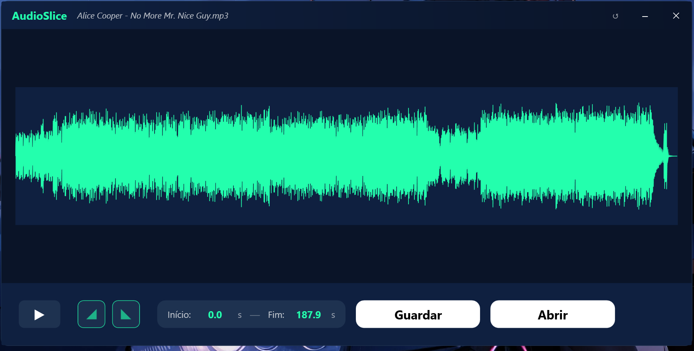

# 🎵 AudioSlice

AudioSlice é um cortador de MP3 moderno e intuitivo desenvolvido em C# com WPF. Ele permite realizar cortes precisos em arquivos de áudio, aplicar efeitos de *Fade In* e *Fade Out*, e exportar o resultado com qualidade máxima (320kbps), preservando todos os metadados originais.

 *(Placeholder para screenshot)*

## ✨ Funcionalidades

- **Visualização de Onda (Waveform):** Interface gráfica que mostra a amplitude do áudio para facilitar a identificação dos pontos de corte.
- **Seleção Interativa:** Arraste as alças diretamente na onda sonora ou digite os tempos exatos nos campos de entrada.
- **Efeitos de Fade:** Controles deslizantes para aplicar desvanecimento no início (*Fade In*) e no final (*Fade Out*) do clipe.
- **Pré-visualização Inteligente:** Ao mover uma alça, o aplicativo toca automaticamente o trecho ajustado para conferência.
- **Exportação de Alta Fidelidade:** 
  - Bitrate constante de **320 kbps**.
  - Preservação total de metadados (Artista, Álbum, Capa, etc.).
  - Nome de arquivo automático (`cut_nome_original.mp3`).
- **Interface Moderna:** Janela sem bordas (*borderless*), tema escuro e controles personalizados.

## 🚀 Tecnologias Utilizadas

- **C# / .NET 10.0**
- **WPF (Windows Presentation Foundation)**
- **NAudio:** Para reprodução de áudio e extração de dados da forma de onda.
- **FFmpeg:** Motor de processamento de áudio para cortes e efeitos de fade.

## 🛠️ Pré-requisitos

Para que o processamento de áudio funcione, você precisa do **FFmpeg** instalado em sua máquina.
O caminho atual configurado no projeto é:
`D:\programas\executaveis\ffmpeg\bin\ffmpeg.exe`

> **Nota:** Se o seu FFmpeg estiver em outro local, altere a variável `_ffmpegPath` no arquivo `AudioSlice/Services/FFmpegService.cs`.

## 📦 Como Executar

1. Clone o repositório.
2. Certifique-se de ter o SDK do .NET 10 instalado.
3. Abra o terminal na pasta raiz e execute:
   ```powershell
   ./run.ps1
   ```
   ou utilize o comando:
   ```powershell
   dotnet run --project AudioSlice/AudioSlice.csproj
   ```

## ⌨️ Comandos de Atalho

- **Espaço:** Play/Pause.
- **Botão Redefinir (↺):** Volta a seleção para o arquivo completo e remove os fades.

---
Desenvolvido como um protótipo funcional para edição rápida de áudio.
